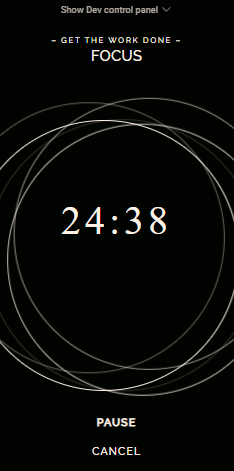
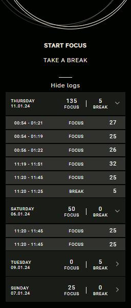

<h1 align="center">
  Pomodoro Focus App
  <p align="center">
    
  </p>
</h1>
<p align="center">
  <a href="#introduction">Introduction</a> •
  <a href="#features">Features</a> •
  <a href="#technologies">Technologies</a> •
  <a href="#getting-started">Getting Started</a> •
  <a href="#live-demo">Live Demo</a> •
  <a href="#screenshots">Screenshots</a> •
  <a href="#credits">Credits</a>
</p>
<br><br><br>

## Introduction

Pomodoro Focus App is a mobile application designed to practice the Pomodoro Technique, developed using React.js and Styled Components. The Pomodoro Technique is a popular time management method that enhances productivity by dividing work into short, focused sessions. More information about the Pomodoro Technique can be found <a href="https://en.wikipedia.org/wiki/Pomodoro_Technique">here.</a>
<br><br>

## Features

**· Activity Logs:** View the history of work sessions and breaks.

**· Mobile Optimization:** App optimized for mobile devices.

**· Timer Control:** Ability to start/pause, stop, and reset the timer.

<br><br>

## Technologies

**·React.js**

**·TypeScript**

**·Styled Components**

**··Zustand**

<br><br>

## Getting Started

**1. Clone the Repository**

```bash
https://github.com/wawrzonnn/pomodoro-focus-app.git
```

**2. Install Dependencies**

```bash
npm install
```

**3. Run the Application**

```bash
npm run dev
```

The application will be running on **http://localhost:5173.**
<br><br>

## Live Demo

Experience Pomodoro Focus App in action: [Live Demo Link](https://pomodoro-focus-app.vercel.app/)
<br><br>

## Screenshots

#### ◇ Timer

<p align="center">
  <a href="./docs/pomodoro1Big.jpg">
    
  </a>
</p>

#### ◇ Activity Logs

<p align="center">
  <a href="./docs/Pomodoro2Big.jpg">
    
  </a>
</p>


## Credits

Design provided by [Nerdbord.io](https://nerdbord.io).
